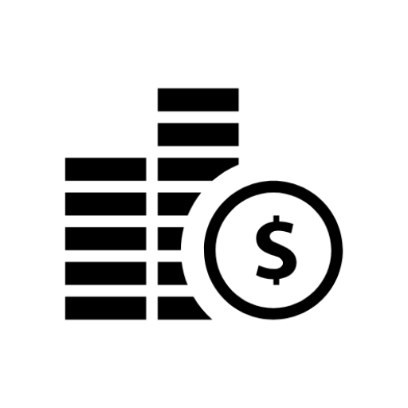
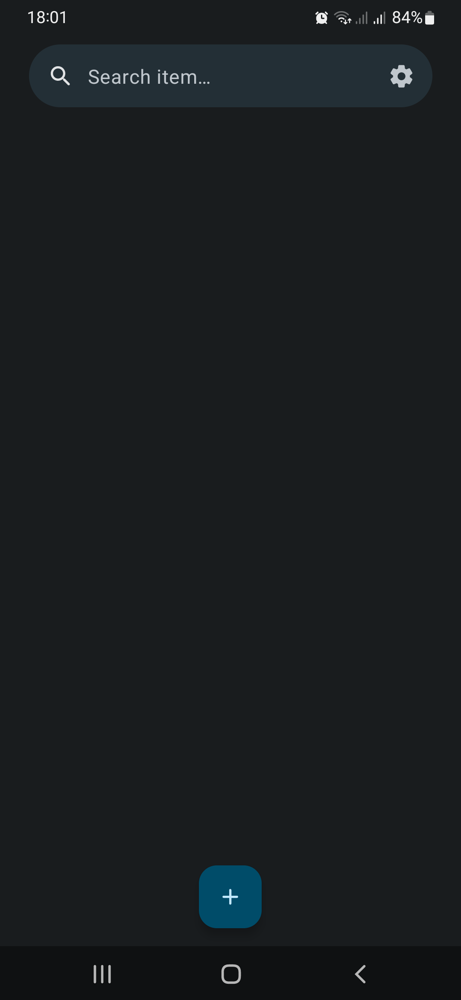
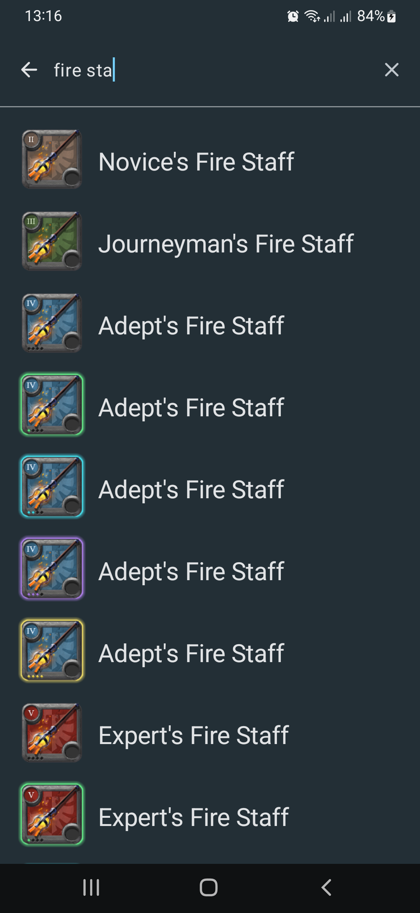
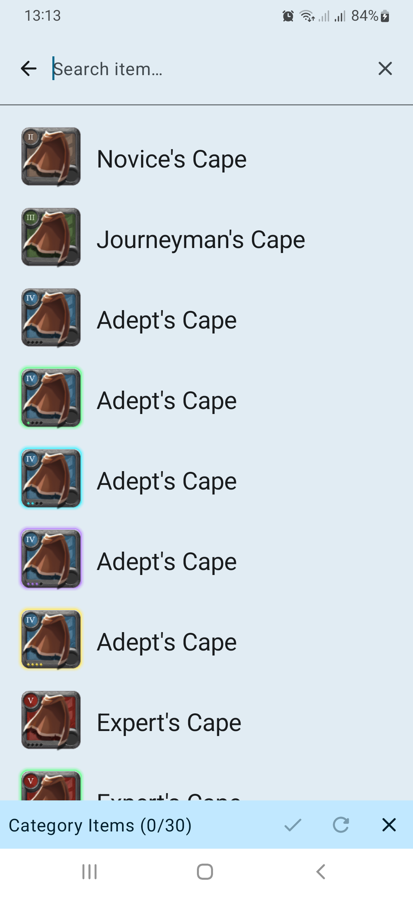
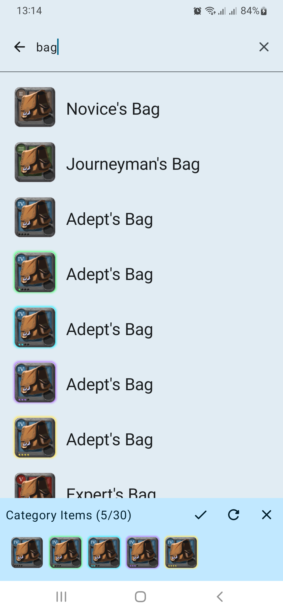
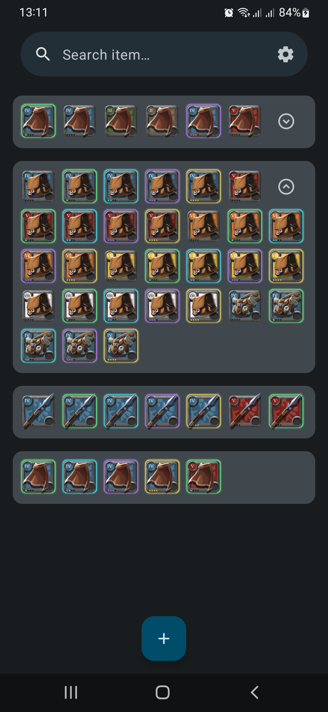
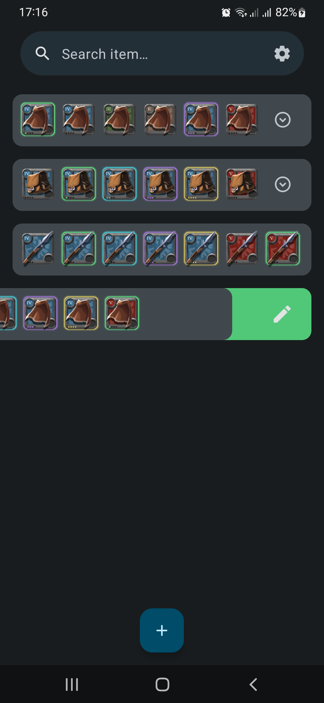
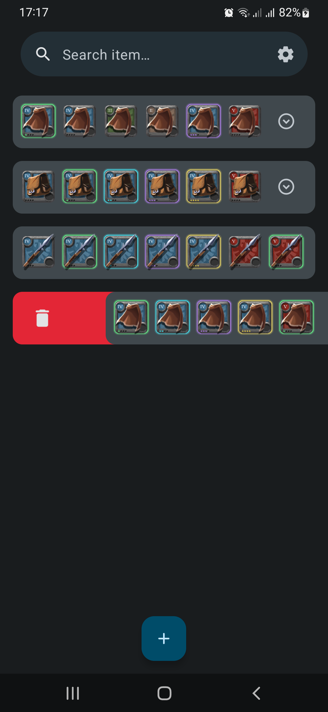
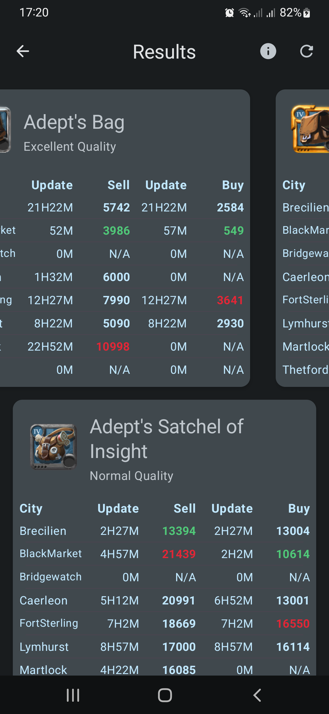
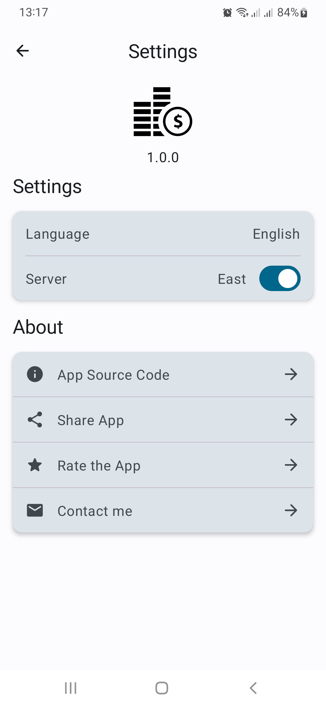

  

<h1 align="center">Albion Online Market Data</h1> 

Albion Online Market Data is a companion app to display market data helping the player make decision for best profit trading for the official game Albion Online.

> Data Source: [[albion-online-data.com](https://albion-online-data.com/)]

## Screenshots

    
    
    
    
    
    
    
    
    

## Android development

Albion Online Market Data is an app that attempts to use the latest libraries and tools. As a summary:

 * Entirely written in [Kotlin](https://kotlinlang.org/).
 * UI completely written in [Jetpack Compose](https://developer.android.com/jetpack/compose).
 * Uses [Kotlin Coroutines](https://kotlinlang.org/docs/reference/coroutines/coroutines-guide.html) throughout.
 * Uses many of the [Architecture Components](https://developer.android.com/topic/libraries/architecture/), including: Room, Lifecycle, Navigation, Paging, DataStore.
 * Uses [Hilt](https://dagger.dev/hilt/) for dependency injection
 * Uses [Rerofit](https://square.github.io/retrofit/) and [OkHttp](https://square.github.io/okhttp/) for network.
 * Uses [Coil](https://github.com/coil-kt/coil) for image loading.
